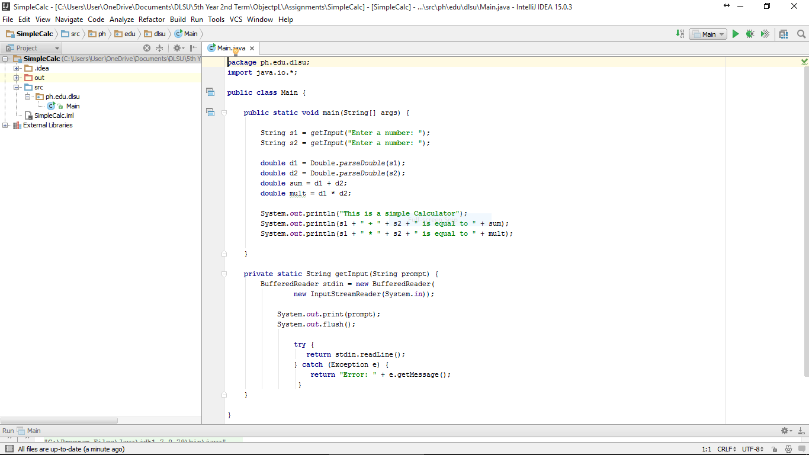
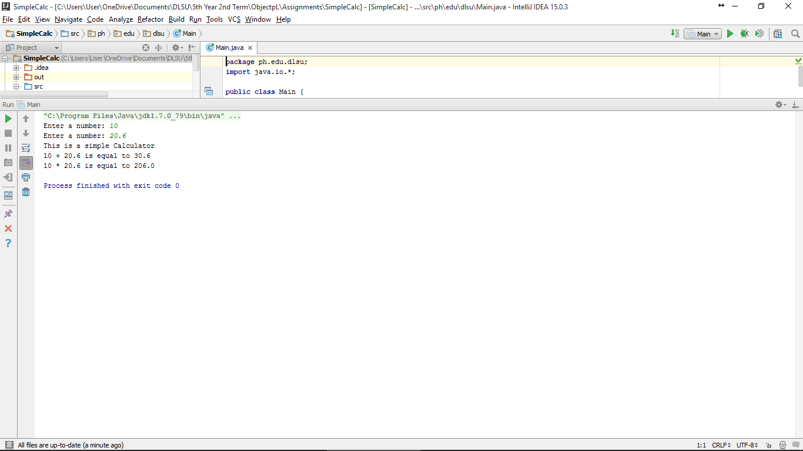

#SimpleCalc

Solving basic arithmetic problems.

#ScreenShots

#Code

~~~
package ph.edu.dlsu;
import java.io.*;

public class Main {

    public static void main(String[] args) {

        String s1 = getInput("Enter a number: ");
        String s2 = getInput("Enter a number: ");

        double d1 = Double.parseDouble(s1);
        double d2 = Double.parseDouble(s2);
        double sum = d1 + d2;
        double mult = d1 * d2;

        System.out.println("This is a simple Calculator");
        System.out.println(s1 + " + " + s2 + " is equal to " + sum);
        System.out.println(s1 + " * " + s2 + " is equal to " + mult);

    }

    private static String getInput(String prompt) {
        BufferedReader stdin = new BufferedReader(
                new InputStreamReader(System.in));

            System.out.print(prompt);
            System.out.flush();

                try {
                   return stdin.readLine();
                } catch (Exception e) {
                    return "Error: " + e.getMessage();
                 }
    }

}
~~~
